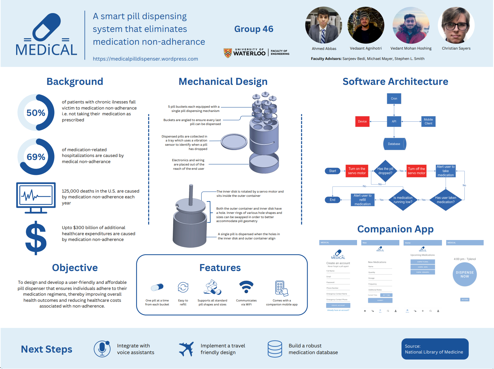

# MEDiCAL: Smart Pill Dispenser System

A smart, WiFi-connected pill dispenser system designed to reduce medication non-adherence among individuals with chronic illnesses through automation, accessibility, and mobile-first usability.

## 📌 Background

Medication non-adherence is a major public health challenge:

- **50%** of patients with chronic illnesses do not take their medications as prescribed.
- **69%** of medication-related hospitalizations result from non-adherence.
- **125,000 deaths** in the U.S. each year are linked to non-adherence.
- **Up to $300 billion** in preventable healthcare expenditures are attributed to this issue.

**MEDiCAL** was developed to address this gap with a user-friendly and affordable pill dispensing solution.

---

## 🎯 Objective

To design and build a smart pill dispenser system that:
- Encourages consistent medication adherence.
- Offers accessible and affordable features.
- Combines mechanical design, software, and hardware integration.
- Improves patient health outcomes and reduces healthcare costs.

---

## 🧠 Key Features

### 💊 Hardware
- **Five individual pill buckets** with single-pill dispensing mechanisms.
- **Swappable inner rings** for pill size customization.
- **Servo-controlled alignment system** for accurate dispensing.
- **Angled bucket design** ensures all pills are dispensed.
- **Vibration sensor tray** detects pill drops and confirms successful dispensing.
- **Electronics safely positioned** away from the user.

### 📱 Companion Android App
- Built with **Kotlin/Java** using **Android Studio**.
- Set schedules, view reminders, and track dispensing.
- Communicates with the Arduino system via **WiFi**.
- Future-proofed for **voice assistant integration** and **travel-friendly design**.

---

## 🛠️ Technologies Used

- **Android App:** Kotlin, Java
- **Embedded System:** Arduino (C/C++)
- **Connectivity:** WiFi Communication
- **Sensors:** Vibration sensor for drop detection
- **Mechanical Design:** Custom pill alignment and dispensing assembly

---

## 📷 Screenshots & Demo

_Check out the [project website](https://medicalpilldispenser.wordpress.com/) for visuals._

---

## 📈 Outcome

- Successfully demonstrated at the University of Waterloo **FYDP Demo Day**.
- Received excellent feedback for usability and technical robustness.
- Tackled real-world problems in healthcare technology through collaborative, interdisciplinary design.

---

## 🚀 Future Improvements

- Voice assistant integration.
- Expandable medication database.
- Travel-ready modular design.

---

## 👨‍💻 Contributors

- **Christian Sayers** – Software Lead  
- Ahmed Abbas  
- Vedaant Agnihotri  
- Vedant Mohan Hoshing

Faculty Advisors: Sanjeev Bedi, Michael Mayer, Stephen L. Smith

---

## 🔗 Links

- [GitHub Repository](https://github.com/christian-sayers/MEDiCAL-android-app)
- [Project Website](https://medicalpilldispenser.wordpress.com/)

